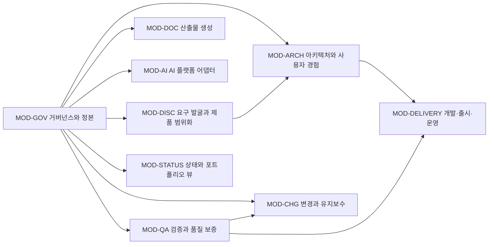

<!-- .ai/tools/aidd.mjs가 project/.aidd/ssot 정본에서 자동 생성했습니다. 직접 수정하지 마세요. -->

# 아키텍처 정의서

## 원칙

| ID | 원칙 | 규칙 |
|---|---|---|
| PRN-001 | 하나의 정본, 여러 뷰 | 사실은 한 번만 정규화하고 대상별 뷰를 생성한다. |
| PRN-002 | 구현보다 의도 우선 | 해결책을 확정하기 전에 성과, 제약과 인수 기준을 정한다. |
| PRN-003 | 주장보다 증거 | 완료와 릴리스 주장에는 연결된 실행 또는 검토 증거가 필요하다. |
| PRN-004 | 기본적으로 가역적 | 롤백 가능한 작은 증분을 선호하고 비가역 변경은 명시적으로 통제한다. |
| PRN-005 | 이식 가능한 코어와 네이티브 어댑터 | 의미와 작업 절차를 공유하고 플랫폼별 검색·훅 설정만 얇게 유지한다. |
| PRN-006 | 위험 비례 엄격성 | 불확실성, 영향 범위, 데이터 민감도와 가역성에 따라 절차를 조정한다. |
| PRN-007 | 기술보다 품질 속성 우선 | 기술 스택은 선호나 유행이 아니라 성과, 요구사항, 품질 속성, 제약과 운영 책임을 근거로 선택한다. |
| PRN-008 | 상황 적응형 방법론 | 공통 정본과 증거 규칙은 유지하면서 프로젝트 특성에 맞는 예측형·적응형·시스템공학·운영·AI 주도 통제를 조합한다. |
| PRN-009 | 배포 환경이 설계의 입력 | 기술 제품명을 성급히 고정하지 않되 DBMS·인스턴스·확장·상태·워크로드·가용성·복구와 운영 제약은 기술 선택 전에 확인한다. |
| PRN-010 | 동시성 불변 조건 우선 | 스레드와 서버 수에 관계없이 지켜야 할 업무 불변 조건을 정의하고 로컬 동기화를 분산 보장으로 오인하지 않는다. |
| PRN-011 | 구현 표면과 문서의 동시 진화 | 화면 경로·API·배치·이벤트·연동·마이그레이션 소스 변경은 현재 문서 또는 기한 있는 문서 현행화 작업과 연결한다. |

## 모듈 의존성 뷰

## 컴포넌트

| ID | 컴포넌트 | 유형 | 책임 | 모듈 |
|---|---|---|---|---|
| CMP-REG | 정본 레지스트리 | 데이터 | 권위 있는 생애주기 사실을 버전 관리되는 JSON으로 저장한다. | MOD-GOV |
| CMP-CLI | AIDD CLI | 애플리케이션 | 링크 검증, 문서 생성, 상태 보고, 어댑터 동기화와 병합 기록을 수행한다. | MOD-GOV, MOD-DOC, MOD-STATUS, MOD-CHG |
| CMP-SKILL | 이식 가능한 스킬 라이브러리 | 에이전트 | 두 AI에 집중된 생애주기 작업 절차와 역할 관점 지침을 제공한다. | MOD-AI |
| CMP-HOOK | 생애주기 훅 어댑터 | 통합 | Codex와 Claude Code에서 같은 결정적 게이트를 호출한다. | MOD-AI, MOD-QA |
| CMP-GIT | Git 증거 통합 | 통합 | 가역성을 제공하고 병합 영향 레코드를 수집한다. | MOD-CHG |
| CMP-DOC | 자동 생성 산출물 | 뷰 | 요구사항, 아키텍처, 추적성, 결정, 테스트, 준비도와 상태를 표시한다. | MOD-DOC, MOD-STATUS |
| CMP-TECH | 기술 스택·기반 게이트 | 거버넌스 | 품질 속성 기반 기술 선택과 기능 개발 전 공통 기반 준비도를 통제한다. | MOD-ARCH, MOD-DELIVERY, MOD-QA |
| CMP-METHOD | 방법론 테일러링 | 거버넌스 | 프로젝트 특성에 따라 방법론 통제를 선택하고 AIDD 단계·증거에 연결한다. | MOD-GOV, MOD-DISC, MOD-ARCH |
| CMP-DEPLOY | 배포·운영 맥락과 설계 위험 | 거버넌스 | 배포 프로필, 워크로드·SLO·복구 조건과 트랜잭션·동시성·성능 위험 패턴을 기술 선택과 검증에 연결한다. | MOD-DISC, MOD-ARCH, MOD-QA, MOD-DELIVERY |
| CMP-EVIDENCE | 게이트 실행과 증거 원장 | 거버넌스 | 변경별 게이트 기준, 검증 증거, 승인과 예외를 구조화하고 완료·릴리스 차단에 사용한다. | MOD-GOV, MOD-QA, MOD-STATUS, MOD-CHG |
| CMP-PLAN | 모듈 전달 계획 | 거버넌스 | 마일스톤·작업·인터페이스·의존성을 요구사항·변경·증거에 연결한다. | MOD-GOV, MOD-STATUS |
| CMP-EVAL | AI 행동 평가 하네스 | 품질 | 공통 픽스처와 루브릭으로 Codex·Claude 실행 결과를 분리해 비교한다. | MOD-AI, MOD-QA |
| CMP-REPO | 저장소 보호 정책 | 거버넌스 | CI 필수 검사와 기본 브랜치 보호의 로컬 구성 및 원격 활성화 증거를 관리한다. | MOD-CHG, MOD-QA |
| CMP-COLLAB | 가변 협업 프로필 | 거버넌스 | 활성 사람 참여자 수에 따라 1인·팀 검토 통제를 전환하고 이력과 저장소 규칙을 동기화한다. | MOD-GOV, MOD-CHG, MOD-QA, MOD-STATUS |
| CMP-IDENTITY | 협업 신원 대조 | 거버넌스 | Git·호스팅 신원을 사람 참여자 또는 봇과 연결하고 설명되지 않은 신원을 고위험 변경과 릴리스 통제에 반영한다. | MOD-GOV, MOD-CHG, MOD-QA, MOD-STATUS |
| CMP-SURFACE | 시스템 표면과 문서 동기화 | 거버넌스 | 모듈별 화면·API·작업·이벤트·연동·마이그레이션을 소스 패턴과 문서 정본에 연결하고 커밋·개발·릴리스 게이트에서 확인한다. | MOD-GOV, MOD-DOC, MOD-CHG, MOD-QA, MOD-DELIVERY |

## 생애주기 흐름

- **FLOW-001 변경 의도에서 증거까지:** 고객 의도 → 요구 발굴 인터뷰 → 정본 요구사항·변경 → 결정과 설계 → 구현 → 검증 증거 → 릴리스 게이트 → 운영 피드백
- **FLOW-002 정본 투영:** project/.aidd/ssot 수정 → 참조 검증 → 문서 생성 → 불일치 탐지 → 원자적 변경 커밋
- **FLOW-003 AI 어댑터 동기화:** AGENTS.md 공통 계약 또는 .ai 스킬·훅 정본 수정 → CLAUDE.md import 확인 → sync-ai 실행 → 스킬 어댑터 트리 비교 → 네이티브 훅 신뢰 검토
- **FLOW-004 배포 맥락에서 기능 개발까지:** 성과·범위 → DG-001 배포·운영 맥락 → 품질 속성·워크로드·동시성 불변 조건 → 방법론 경로 선택 → TG-001 기술 스택 선정 → 아키텍처·트랜잭션·실행 토폴로지 → TG-002 기반·위험 검증 → 기능 증분 계획 → 개발·검증
- **FLOW-005 소스와 문서 동기화:** 변경 유형 분류 → 모듈별 SURF 영향 확인 → 요구분석·설계 또는 기존 기준선 검토 → 즉시 문서화 또는 기한 있는 WRK 결정 → 구현·문서 변경 → staged 커밋 검사 → 정합성 검토·증거

## 역할 관점

| ID | 역할 관점 | 필수 증거 |
|---|---|---|
| ROLE-PM | PM/제품 | 성과, 범위, 우선순위, 이해관계자 게이트 |
| ROLE-BA | 사업·도메인 분석 | 요구사항, 규칙, 유즈케이스, 예외, 용어집 |
| ROLE-UX | UX/접근성 | 사용자 여정, 레이아웃 패턴, 상호작용 상태, 접근성 기준, 목업 |
| ROLE-AA | 애플리케이션·솔루션 아키텍처 | 경계, 인터페이스, 품질 속성, 트랜잭션·동시성 불변 조건, 실행 토폴로지, ADR, 의존 방향 |
| ROLE-DA | 데이터 아키텍처 | 개념 모델, 소유권, 계보, 분류, 보존 |
| ROLE-DBA | 데이터베이스 관리 | DBMS·복제·클러스터 제약, 물리 모델, 격리·락·원자성, 마이그레이션, 성능, 백업, 복구 증거 |
| ROLE-SEC | 보안/개인정보 | 위협 모델, 오용 사례, 통제, 비밀정보, 잔여 위험 |
| ROLE-INFRA | 인프라/SRE | 배포 프로필, 인스턴스·확장 토폴로지, IaC, 용량, SLO, 관측성, 복구 |
| ROLE-DEVOPS | DevOps | CI/CD, 품질 게이트, 산출물 출처, 배포, 롤백 |
| ROLE-DEV | 개발 | 구현, 표준, 공통 컴포넌트, 개발자 가이드 |
| ROLE-QA | QA/테스트 | 위험 기반 케이스, 동시성·다중 인스턴스·부하·장애 검증, 자동화, 결과, 회귀, 결함 확인 |
| ROLE-AUDIT | 감리/검토 | 추적성, 통제 예외, 독립 반대 검토, 게이트 무결성 |
| ROLE-OPS | 운영/지원 | 런북, 경보, 진단, 운영자 가이드, 사용자 매뉴얼 |
