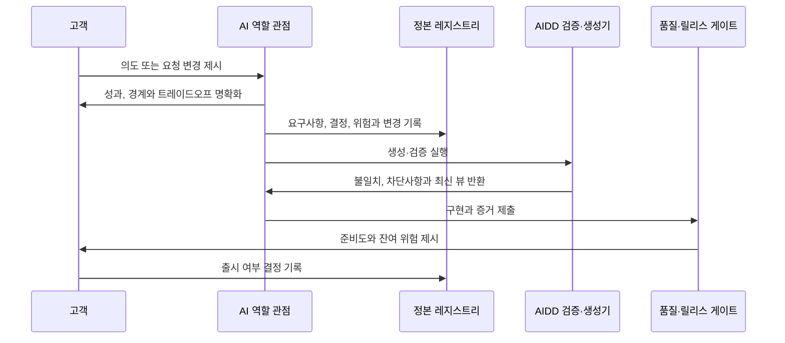

<!-- .ai/tools/aidd.py가 project/.aidd/ssot 정본에서 자동 생성했습니다. 직접 수정하지 마세요. -->

# 시퀀스 다이어그램

## SEQ-001 — 정본 변경 순환

요구사항: REQ-001, REQ-002, REQ-003, REQ-005, REQ-018

```mermaid
sequenceDiagram
  participant CUSTOMER as 고객
  participant AGENT as AI 역할 관점
  participant SSOT as 정본 레지스트리
  participant CLI as AIDD 검증·생성기
  participant GATE as 품질·릴리스 게이트
  CUSTOMER->>AGENT: 의도 또는 요청 변경 제시
  AGENT->>CUSTOMER: 성과, 경계와 트레이드오프 명확화
  AGENT->>SSOT: 요구사항, 결정, 위험과 변경 기록
  AGENT->>CLI: 생성·검증 실행
  CLI->>AGENT: 불일치, 차단사항과 최신 뷰 반환
  AGENT->>GATE: 구현과 증거 제출
  GATE->>CUSTOMER: 준비도와 잔여 위험 제시
  CUSTOMER->>SSOT: 출시 여부 결정 기록
```
